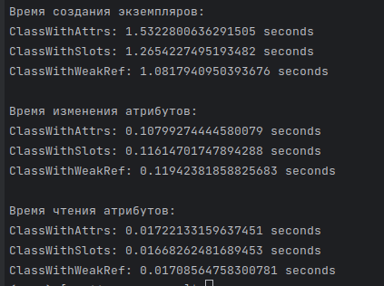

Задание 1:

Измерение времени создания класса / изменения атрибута / чтения атрибута для классов
с атрибутами обычными / slots / weakref:

Для каждого значения усреднялось 10 измерений времени для 1 миллиона значений
(созданий классов / изменения или чтения атрибутов).

Отсюда можно сделать вывод:

1) Создание классов с weakref атрибутами происходит быстрее всего, а с обычными медленнее,
причем слоты создаются на, примерно, 20%, а обычные на 40% медленнее, чем weakref;
2) Изменение атрибутов быстрее для обычных, примерно, до 8%. У weakref и slots 
изменение одинаково по времени;
3) Чтение атрибутов происходит за одинаковое время и не зависит от типа атрибутов.
