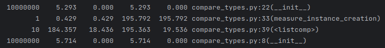

Вызов функций происходил в следующем порядке - обычные атрибуты, слоты, слабые ссылки:

Названия столбцов у таблицы с вызовами, где:
1) ncalls: Количество вызовов функции или метода. Это показывает, сколько раз функция была вызвана.

2) tottime: Общее время, затраченное на выполнение функции, исключая время выполнения вложенных вызовов. Это время измеряется в секундах.

3) percall: Среднее время, затраченное на каждый вызов функции (tottime деленное на ncalls).

4) cumtime: Общее время, затраченное на выполнение функции, включая время выполнения всех вложенных вызовов. Это время также измеряется в секундах.

5) percall: Среднее время, затраченное на каждый вызов функции, включая все вложенные вызовы (cumtime деленное на ncalls).

ncalls  tottime  percall  cumtime  percall filename:lineno(function)

common_attribute

slots_attribute

weakref_attribute

Видно, что наименьшее время, затраченное на создание классов имеют атрибуты weakref, далее slots,
а обычные атрибуты создаются дольше всех. Это видно, как из средних показателей, так и из абсолютных

Средний нерекурсивный вызов у слотов требует на ~40% больше, а у обычных на ~50% больше времени, чем у слабых ссылок 

common_attribute

slots_attribute

weakref_attribute

Видно, что у обычных атрибутов наибольший скачок по памяти, а у слабых ссылок наименьший.
Примерно распределение скачков следующее:

- Обычные - 1.6 ГБ
- Слоты - 1.4 ГБ
- Слабые ссылки - 0.97 ГБ

Скачки происходили в момент создания 1 млн экземпляров класса.

Вывод:

Наибольшее потребление памяти и времени вызова у обычных атрибутов (что логично), а
наименьшее потребление времени и памяти у слабых ссылок.
